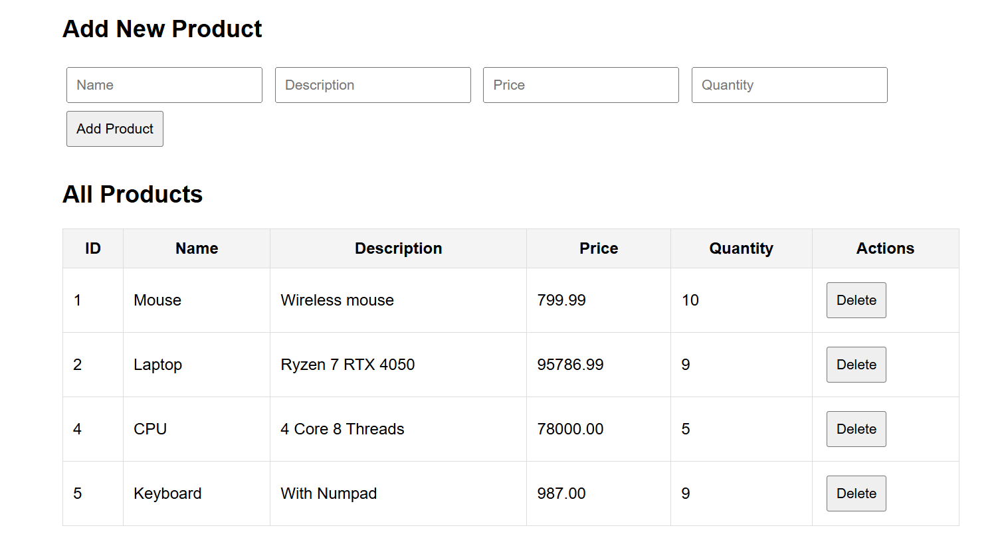

# FastAPI Product Manager

This is a simple Product Management API built with **FastAPI** and **SQLite**. It provides RESTful endpoints for creating, retrieving, updating, and deleting products. It also serves a static frontend (e.g., `index.html`) if present.

---

## 🚀 Features

* FastAPI for backend API
* SQLite for data storage
* SQLAlchemy ORM
* CORS support for cross-origin requests
* Static file support for serving frontend (`index.html`)
* Swagger UI documentation at `/docs`

---

## 🗂️ Project Structure

```
keploySess2/
├── main.py                     # FastAPI application entry point
├── index.html                  # Simple Frontend
├── app/
│   ├── api/
│   │   └── routes.py          # API endpoints
│   ├── crud.py                # CRUD logic for database
│   ├── database.py            # Database connection and session
│   ├── models.py              # SQLAlchemy models
│   └── schemas.py             # Pydantic schemas
├── tests/
│   └── test_main.py           # Unit, integration, and API tests
```

---

## 🔧 Setup Instructions

### 1. Clone the Repository

```bash
git clone https://github.com/your-username/keploySess2.git
cd keploySess2
```

### 2. Create a Virtual Environment (Optional but Recommended)

```bash
python -m venv venv
source venv/bin/activate  # On Windows: venv\Scripts\activate
```

### 3. Install Dependencies

```bash
pip install -r requirements.txt
```

If `requirements.txt` is not available, manually install:

```bash
pip install fastapi uvicorn sqlalchemy pydantic pytest pytest-cov
```

### 4. Run the Server

```bash
python -m uvicorn main:app --reload
```

* Visit: [http://127.0.0.1:8000](http://127.0.0.1:8000) – Static HTML frontend
* Visit: [http://127.0.0.1:8000/docs](http://127.0.0.1:8000/docs) – Swagger UI for API

---

## 📦 API Endpoints

### `GET /products/`

Get a list of all products.

### `GET /products/{id}`

Get a single product by ID.

### `POST /products/`

Create a new product.

### `PUT /products/{id}`

Update a product by ID.

### `DELETE /products/{id}`

Delete a product by ID.

---

## 🧾 Example JSON for Creating a Product

```json
{
  "name": "Laptop",
  "description": "Powerful laptop",
  "price": 75000.0,
  "quantity": 10
}
```

---

## 🧪 Testing

### ✅ Unit Tests

* Located in `tests/test_main.py`
* Focus on testing business logic in CRUD operations
* Uses both mocked and real DB sessions

### ✅ Integration Tests

* Ensure database interaction is correct
* CRUD operations are verified on an in-memory SQLite DB

### ✅ API Tests

* Uses FastAPI's `TestClient` to simulate actual HTTP requests
* Tests cover endpoint correctness and expected status codes/response bodies

### Run Tests

```bash
pytest --cov=app tests/
```

### Example Test Coverage Screenshot



### Minimum Coverage

> ✅ Achieved **70%+** test coverage across unit and API layers.

---

## 📌 Manual Testing

In addition to automated tests, manual validation was done using the frontend (`index.html`). Here are some example test scenarios:

### Add Valid Product

* **Input:** `Phone`, `Smartphone`, `25000`, `10`
* **Expected:** Product gets created and listed

### Add Product with Missing Name

* **Input:** Leave name blank
* **Expected:** Backend returns validation error

### Edit and Delete Product

* **Expected:** Product gets updated/deleted and reflected in UI and database

---

## 🧰 Tech Stack

* **FastAPI**: Web framework
* **SQLite**: Lightweight relational database
* **SQLAlchemy**: ORM
* **Pydantic**: Data validation
* **Uvicorn**: ASGI server
* **Pytest + pytest-cov**: Testing framework and coverage tool

---

## 📷 Screenshot

`screenshot_coverage.png`
